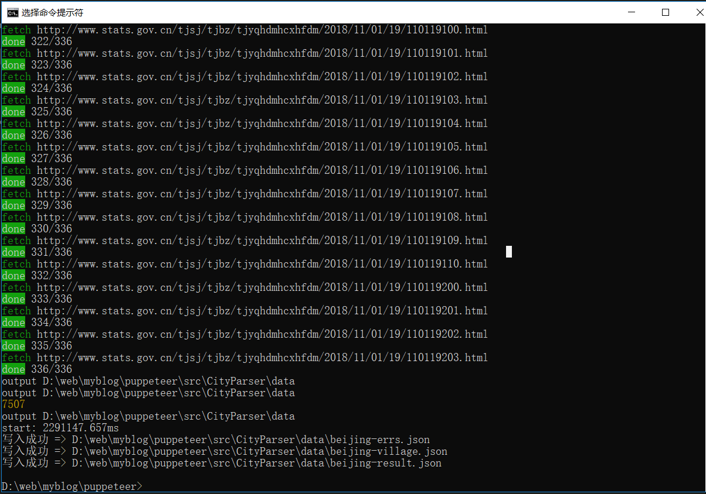

- [[数据][json格式] 2016年统计用区划代码和城乡划分代码](https://blog.csdn.net/isea533/article/details/78862295)
- [国家统计局统计用区划代码和城乡划分代码---爬虫、详细分析](https://blog.csdn.net/dta0502/article/details/82024462)
- [](https://www.sl-swkj.com/api/wx/region/list?pid=0&tdsourcetag=s_pctim_aiomsg)

```js

```

1. 获取省份list `getProvince.js`

.png)


2. 获取某个省份 `index.js`


